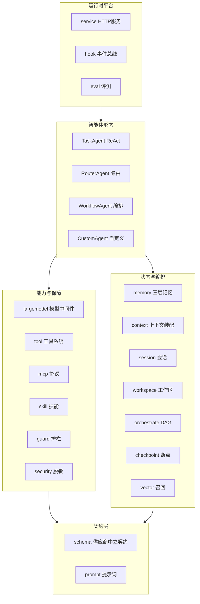
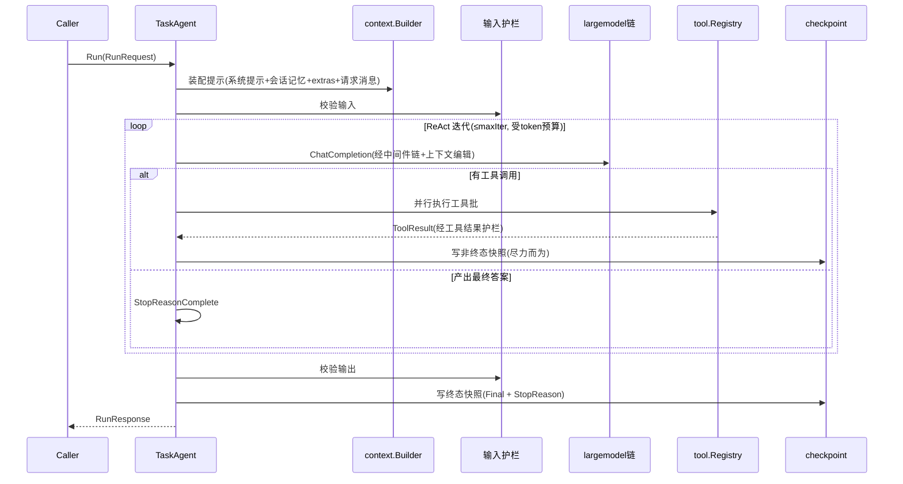

# 架构总览

## 定位

vage 是**库优先**的框架:每个子系统是一个可独立引入、以接口解耦的 Go 包。它们通过供应商中立的 `schema` 契约层互相通信。使用方按需组装,或直接用 `service` 包把组装好的 Agent 作为 HTTP 运行时部署。

## 分层

## 依赖拓扑核心规则

1. **`schema` 是根契约包**:只依赖外部 `aimodel` 与标准库,零内部依赖。所有其他包依赖它,反向依赖被章程禁止。
2. **TaskAgent 是集成中枢**:四种 Agent 中,只有任务型直接依赖模型、工具、记忆、护栏、技能、检查点、hook、context。其余三型只依赖 `agent` + `schema`(工作流型另依赖 `orchestrate`)。它只**编排**这些能力,不实现它们 —— 全部以接口/管理器形式注入。
3. **能力以接口注入**:各子系统对 TaskAgent 暴露的都是接口(ToolRegistry、memory.Manager、Guard、IterationStore、ChatCompleter 链……),因此每一项都可被替换或 mock。

## 一次 TaskAgent 运行的数据流

## 横切关注点

| 关注点 | 承载机制 | 说明 |
|--------|----------|------|
| 可观测 | `schema.Event` + `hook.Manager` | 全生命周期结构化事件,通过 ctx 中的 Emitter 发射 |
| 流式 | `schema.RunStream` | 拉取式通道;非流式 Agent 可被适配为流式 |
| 断点续跑 | `checkpoint`(迭代级)/ `orchestrate`(DAG 级) | 两套独立机制,勿混淆 |
| Token 预算 | `RunOptions` + largemodel budget 中间件 | 每轮 LLM 调用前、每次工具批前双点检查 |
| 上下文膨胀 | `largemodel` 上下文编辑 + `memory` 压缩 | 折叠旧工具结果、按重要度/预算压缩历史 |
| 安全 | `guard` + `security` | 三态护栏 + 跨边界凭证脱敏 |
| 资源隔离 | `tool.ResourceTracker` + `sessionview` | 工具资源标签、子代理只读快照与预算 |

## 架构决策记录(ADR)

架构级、有长期影响或多种权衡的决策记录于 `architecture/adr/`(编号 `NNNN-title.md`)。ADR 需人工评审通过后方可写入,新建默认 `proposed` 状态。当前尚无 ADR;后续可将以下已体现在代码中的关键决策补记为 ADR:

- 以 `aimodel.ChatCompleter` 作为唯一模型接入点(供应商中立)。
- `schema` 作为零内部依赖的根契约包。
- `checkpoint` 与 `orchestrate` checkpoint 双轨分离。
- 上下文编辑采用"收敛策略单一判定点"折叠旧工具结果。
