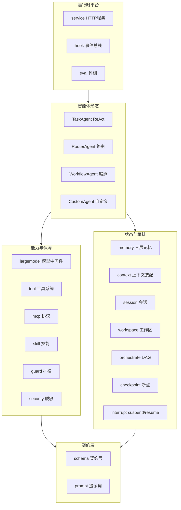
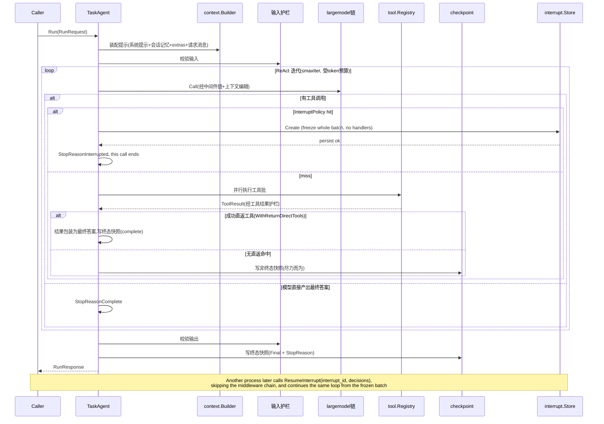

# 架构总览

## 定位

vage 是**库优先**的框架:每个子系统是一个可独立引入、以接口解耦的 Go 包。它们通过 `schema` 契约层互相通信 —— 该层以 provider-neutral 的 `Message`(canonical `role`/`parts` + 可选 `origin` 回放缓存)为通用语言,并附带协议标识。使用方按需组装,或直接用 `service` 包把组装好的 Agent 作为 HTTP 运行时部署。

## 分层

```mermaid
graph TD
    subgraph L4[运行时平台]
        service[service HTTP服务]
        hook[hook 事件总线]
        eval[eval 评测]
    end
    subgraph L3[智能体形态]
        task[TaskAgent ReAct]
        router[RouterAgent 路由]
        workflow[WorkflowAgent 编排]
        custom[CustomAgent 自定义]
    end
    subgraph L2[能力与保障]
        model[largemodel 模型中间件]
        tool[tool 工具系统]
        mcp[mcp 协议]
        skill[skill 技能]
        guard[guard 护栏]
        security[security 脱敏]
    end
    subgraph L1[状态与编排]
        memory[memory 三层记忆]
        vctx[context 上下文装配]
        session[session 会话]
        workspace[workspace 工作区]
        orchestrate[orchestrate DAG]
        checkpoint[checkpoint 断点]
        interrupt[interrupt suspend/resume]
    end
    subgraph L0[契约层]
        schema[schema 契约层]
        prompt[prompt 提示词]
    end

    L4 --> L3
    L3 --> L2
    L3 --> L1
    L2 --> L0
    L1 --> L0
```

> `vector` 归属 platform `service` 领域(可插拔召回后端),不在 L1 编排层;见 [overview.md](../overview.md) 领域地图。

## 生产依赖拓扑判定

CI 在 `integrations/architecture_test.go` 中扫描**全部受管生产 Go 包**的直接 import 边(不含 `_test.go`、`integrations` 夹具;含各 `GOOS`/`GOARCH` 构建标签下的生产文件,不限于当前 CI 宿主平台)。规则与下表逐项一致;维护者新增包或合法组合边时须同步更新测试与本文。

### 判定口径

1. **基本单位**是直接 import 边,不是 `go list -deps` 闭包。同一架构组件内的根包/子包不构成跨组件边。
2. **L0 契约**:`schema`/`prompt` 只依赖标准库;任意组件均可 import L0。
3. **默许同组件**:包路径归属同一组件时,跨子包 import 合法。
4. **层级下降**:源组件层级 **严格高于** 目标组件层级时 import 合法(如 L3→L2、L4→L3、L2→L0)。
5. **组合/适配边**:不满足层级下降但属有意集成的跨组件边,须在下方允许表或 ADR 精确豁免中列出;宽泛前缀白名单禁止。
6. **硬红线**:L2 能力组件不得反向借用 L1 状态(`tool→memory` 等);`largemodel` 不得 import `tool`/`memory`(资源契约已下沉至 `schema`)。

### 组件归属

| 组件 | 层级 | 包前缀 |
|------|------|--------|
| `schema` | L0 | `schema` |
| `prompt` | L0 | `prompt` |
| `agent` | L3 | `agent`(根包) |
| `taskagent` | L3 | `agent/taskagent` |
| `routeragent` | L3 | `agent/routeragent` |
| `workflowagent` | L3 | `agent/workflowagent` |
| `memory` | L1 | `memory` |
| `context` | L1 | `context` |
| `session` | L1 | `session`, `session/tree`, `session/tree/vectorhook` |
| `workspace` | L1 | `workspace` |
| `sessionview` | L1 | `sessionview` |
| `orchestrate` | L1 | `orchestrate` |
| `checkpoint` | L1 | `checkpoint` |
| `interrupt` | L1 | `interrupt` |
| `largemodel` | L2 | `largemodel` 及子包 |
| `tool` | L2 | `tool` 及子包 |
| `mcp` | L2 | `mcp/client`, `mcp/server` |
| `skill` | L2 | `skill` |
| `guard` | L2 | `guard` |
| `security` | L2 | `security/credscrub` |
| `service` | L4 | `service` |
| `hook` | L4 | `hook` |
| `eval` | L4 | `eval` |
| `vector` | platform | `vector` 及子包 |

未映射的生产包会使 CI 失败。

### 允许的组合/适配边(跨组件)

| 源组件 | 目标组件 | 用途 |
|--------|----------|------|
| `routeragent` | `agent` | 路由 Agent 基类 |
| `taskagent` | `agent`, `hook` | Task Agent 基类与事件 hook |
| `workflowagent` | `agent` | Workflow Agent 基类 |
| `context` | `memory`, `session`, `workspace`, `vector`, `hook` | 上下文装配 |
| `session` | `memory`, `largemodel`, `hook`, `vector` | 会话树、压缩 hook 与向量 hook |
| `tool` | `agent`, `session`, `sessionview`, `workspace`, `vector` | agent-as-tool、状态/检索工具 |
| `mcp` | `tool`, `security`, `agent` | MCP 工具桥接与脱敏 |
| `vector` | `hook` | 归档 hook |

其余跨组件边须层级下降或 import L0。暂不能移除的违规边只能以**精确 source 包→target 包**写入 `edgeExemptions` 并附 ADR 路径。

### 禁止的跨组件边(硬红线)

| 源组件 | 目标组件 |
|--------|----------|
| `tool` | `memory` |
| `largemodel` | `tool`, `memory` |

## 依赖拓扑核心规则

1. **`schema` 是根契约包**:只依赖标准库,零 vage 内部依赖、零 `aimodel` 依赖。厂商 wire 编解码收敛在 `largemodel/provider/*`。所有其他包依赖它,反向依赖被禁止。
2. **TaskAgent 是集成中枢**:四种 Agent 中,只有任务型直接依赖模型、工具、记忆、护栏、技能、检查点、interrupt store、hook、context。其余三型只依赖 `agent` + `schema`(工作流型另依赖 `orchestrate`)。它只**编排**这些能力,不实现它们 —— 全部以接口/管理器形式注入。
3. **能力以接口注入**:各子系统对 TaskAgent 暴露的都是接口(ToolRegistry、memory.Manager、Guard、IterationStore、largemodel.Caller 链……),因此每一项都可被替换或 mock。

## 一次 TaskAgent 运行的数据流

```mermaid
sequenceDiagram
    participant Caller
    participant Task as TaskAgent
    participant Ctx as context.Builder
    participant Guard as 输入护栏
    participant LLM as largemodel链
    participant Tool as tool.Registry
    participant CP as checkpoint
    participant IR as interrupt.Store

    Caller->>Task: Run(RunRequest)
    Task->>Ctx: 装配提示(系统提示+会话记忆+extras+请求消息)
    Task->>Guard: 校验输入
    loop ReAct 迭代(≤maxIter, 受token预算)
        Task->>LLM: Call(经中间件链+上下文编辑)
        alt 有工具调用
            alt InterruptPolicy hit
                Task->>IR: Create (freeze whole batch, no handlers)
                IR-->>Task: persist ok
                Task->>Task: StopReasonInterrupted, this call ends
            else miss
                Task->>Tool: 并行执行工具批
                Tool-->>Task: ToolResult(经工具结果护栏)
                alt 成功直返工具(WithReturnDirectTools)
                    Task->>Task: 结果包装为最终答案,写终态快照(complete)
                else 无直返命中
                    Task->>CP: 写非终态快照(尽力而为)
                end
            end
        else 模型直接产出最终答案
            Task->>Task: StopReasonComplete
        end
    end
    Task->>Guard: 校验输出
    Task->>CP: 写终态快照(Final + StopReason)
    Task-->>Caller: RunResponse

    Note over Caller,IR: Another process later calls ResumeInterrupt(interrupt_id, decisions),<br/>skipping the middleware chain, and continues the same loop from the frozen batch

```

## 横切关注点

| 关注点 | 承载机制 | 说明 |
|--------|----------|------|
| 可观测 | `schema.Event` + `hook.Manager` | 全生命周期结构化事件,通过 ctx 中的 Emitter 发射 |
| 流式 | `schema.RunStream` | 拉取式通道;非流式 Agent 可被适配为流式 |
| 断点续跑 | `checkpoint`(迭代级)/ `orchestrate`(DAG 级)/ `interrupt` (pre-tool-batch suspend, cross-process) | Three independent mechanisms. `interrupt` is a pre-execution hang plus injected human decisions, not crash replay. |
| Token 预算 | `RunOptions` + largemodel budget 中间件 | 每轮 LLM 调用前、每次工具批前双点检查 |
| 上下文膨胀 | `largemodel` 上下文编辑 + `memory` 压缩 | 折叠旧工具结果、按重要度/预算压缩历史 |
| 安全 | `guard` + `security` | 三态护栏 + 跨边界凭证脱敏 |
| 资源隔离 | `schema.ResourceTracker`(规范) / `tool.ResourceTracker`(别名) + `sessionview` | 工具资源标签、子代理只读快照与预算 |

## 架构决策记录(ADR)

架构级、有长期影响或多种权衡的决策记录于 `architecture/adr/`(编号 `NNNN-title.md`)。ADR 需人工评审通过后方可写入,新建默认 `proposed` 状态。

Recorded:

- Independent interrupt state machine rather than extending `checkpoint.IterationStore` for cross-process human-in-the-loop suspend: [0001-interrupt-independent-state-machine.md](adr/0001-interrupt-independent-state-machine.md).
- Session memory namespaced by caller-declared `(agentID, sessionID)`: [0002-session-memory-namespace.md](adr/0002-session-memory-namespace.md) (`proposed`).
- Single-slot Run parameter resolver (parameterization, not a new plane) and host-side routing Caller assembly via `BuildCaller` / `ComposeCaller`: [0003-run-param-resolver.md](adr/0003-run-param-resolver.md).

Candidates still in code that later ADRs may capture:

- 以 `largemodel.Caller` 作为唯一模型接入点,其后端是 `largemodel/router` 池(单端点即一个端点的池);重试、端点健康与同协议故障转移取自 router 而非自研。
- `schema` 作为仅依赖标准库的根契约包(`Message` 为 provider-neutral canonical + 可选 `origin`)。
- `checkpoint` 与 `orchestrate` checkpoint 双轨分离。
- 上下文编辑采用"收敛策略单一判定点"折叠旧工具结果。
- DAG 执行器"锁契约收尾单点"(错误与取消收敛到同一收尾路径)。
