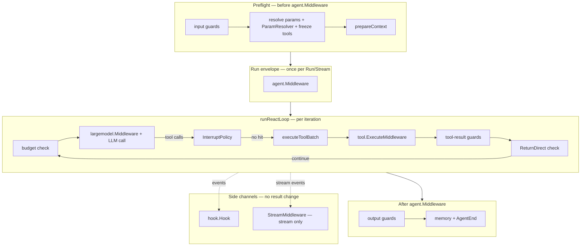

# 设计:agent-core

对应领域行为见 [agent-core.md](agent-core.md)。本文件记录技术实现层面的设计决策与契约,不重述代码可还原的细节。

## 组件与职责

| 包 | 关键类型 | 设计角色 |
|----|----------|----------|
| `schema` | `Protocol`/`RunRequest`/`RunResponse`/`RunOptions`/`Message`/`MessagePart`/`Usage`/`ToolCall`/`ToolDef`/`ToolResult`/`ContentPart`/`Event`/`RunStream`/`StopReason` | provider-neutral 契约层;`Message` 以私有 canonical 状态和访问器统一读写,不解释 provider wire |
| `largemodel/provider/openais`、`provider/anthropics` | provider 路由绑定与 message codec | 按 provider 聚合 native wire ↔ canonical message 转换、原生回放、协议结构校验与 Backend 路由绑定 |
| `agent` | `Agent`/`StreamAgent` 接口、`Base`/`Config`、`RunFunc`、`CustomAgent`、`StreamMiddleware`、`Middleware`/`MiddlewareFunc`/`ChainMiddleware`、`RunText`/`RunStreamText`/`RunToStream` | 统一接口 + 非流式↔流式适配胶水 + Agent Run 中间件契约 |
| `agent/taskagent` | `New` / `NewValidated` + 一整套 `With*` 选项、`Quick` / `QuickValidated`、`Run`/`RunStream`/`Resume`、`WithMiddleware`、`InterruptConfig`+`WithInterrupt` / `GuardsConfig`+`WithGuards`、`WithInterruptStore`/`WithInterruptPolicy`/`WithInterruptToolNames`/`ResumeInterrupt` | ReAct loop and integration hub; `New + Option` is the full constructor contract, `NewValidated` adds construction-time validation of the final Interrupt state, `Quick`/`QuickValidated` are thin wrappers over the common arguments. Interrupt suspend/resume: design decisions below. |
| `interrupt` | `Record`/`Store`/`MapStore`/`FileStore`, `EffectiveParams`, status machine `Status` | Persistence contract for cross-process interrupt/resume, fully independent of `checkpoint` (see [orchestration](../orchestration/orchestration.md) OR-9). |
| `agent/routeragent` | `Route`/`RouteFunc`、内置 `FirstFunc`/`IndexFunc`/`KeywordFunc`/`RandomFunc`/`LLMFunc` | 分发策略 |
| `agent/workflowagent` | `New`/`NewDAG`/`NewDAGWithEdges`/`NewLoop` | 顺序/图/循环编排,委托 `orchestrate` |
| `prompt` | `PromptTemplate`、`StringPrompt`、`NewPromptTemplate` | 基于 `text/template` 的提示词渲染 |

## 关键设计决策

- **依赖注入而非硬编码**:TaskAgent 的模型、工具、记忆、护栏、技能、检查点、hook、上下文构建器全部通过 `With*` 选项以接口注入。默认值缺省时行为退化(如无迭代存储则不可 Resume),而非报错崩溃。
- **一次 Run 一个装饰器接缝,同步/流式同链**:`agent.Middleware` 以 `Wrap(next RunFunc) RunFunc` 装饰整次 ReAct 执行,TaskAgent 在 `Run` 与 `RunStream` 上各驱动同一条链恰好一次(第一个注册者最外层,`ChainMiddleware` 跳过 nil)。不引入 before/after/wrap_model/wrap_tool 等分阶段巨型接口,也不合并模型、事件与工具执行中间件。
- **草拟与终态分离**:链内只产生「草拟 `RunResponse`」,输出护栏、消息记忆写入与成功终态事件都在链之后对最终响应执行,因此短路或改写后的消息与 ReAct 产物受完全相同的约束,并成为 `AgentEnd.Message` 的唯一来源。`SessionID`/`Duration` 在终态阶段由框架回写,不能伪造;`nil, nil` 转 `ErrNilMiddlewareResponse`。
- **真实终态与报告的 stop reason 分离**:`runContext` 记录 ReAct 循环实际达成的 `stopReason` 与是否真实跑过(`reactRan`),与响应里可被中间件改写的 `StopReason` 分开。护栏对部分结果的宽容、预算耗尽事件都只看真实循环状态,避免伪造的 stop reason 触发假预算事件或放行护栏。
- **直返工具作为 Agent 控制流而非工具层策略**:`taskagent.WithReturnDirectTools(names...)` 按名称声明哪些工具的成功结果可直接作为最终答案。判定收敛在共享 `runReactLoop` 的工具批处理之后(`executeToolBatch` 额外回传护栏后的 `ToolResult` 切片),因此 `Run` / `RunStream` / `Resume` 复用同一语义,不另建同步专用循环。批内全部工具照常执行完毕,再按模型 `ToolCalls` 顺序选第一个「名称已配置且成功」的候选;失败绝不短路。`schema.ToolDef` / `ToolResult` / `RunResponse` / StopReason 均不扩展,`complete` 只是多了一条到达路径。选「名字配置」而非扩 schema,是因为直返决定的是某个 Agent 的结束策略——同一工具可在一个 Agent 直返、在另一个继续推理。
- **上下文先于链构建**:`RunStream` 提前构建上下文以保持构建错误同步浮现;`prepareContext` 在链之前完成,中间件改写 `req.Messages` 不回溯影响模型输入,需要改输入走输入护栏或 `vctx` 源。`Resume` 复用与 Run 相同的循环与终态路径但刻意不进链。
- **通过 context.Context 传递会话身份、Emitter 与 Run 值**:深层工具处理器无需显式参数即可读取 SessionID、向流写事件(内置事件直接用 Emitter,应用自定义事件走 `EmitCustomData`)、在一次运行内互传临时值。这使工具签名保持稳定。
- **流通道语义**:`RunStream` 为拉取式;成功结束返回 `io.EOF`,生产者错误在缓冲事件排空后浮现,关闭后再读返回专用错误。
- **消费样板收进通道自身,但不含渲染策略**:「循环 `Recv` 到 `io.EOF`、按 `Event.Data` 分派」这段在每个消费者处都一样,因此以 `ForEach` 收进 `RunStream`;打印格式、日志等级、错误是否致命则留在调用方 —— 它们是应用决策,框架给出默认会诱导误用。`ForEach` 吞掉 `io.EOF` 是因为「读到末尾」是成功而非调用方需要分类的失败;回调返回错误既表示失败也表示「我读够了」,两种意图都终止 drain 并原样上抛,不另设提前退出信号。
- **事件累积器只做折叠,不做过滤**:`EventAccumulator` 是 `largemodel.StreamAccumulator` 在事件层的对位物 —— 后者把 provider 分片折成一轮,前者把一次运行的事件折回非流式调用方要的形状。它不按 `AgentID` / `ParentID` 过滤:合并流或转发子代理事件的运行会交错文本,而「哪些事件算这次运行的」是一项策略,选择它属于调用方而非累积器(章程原则 4)。缺少 `LLMCallEnd` 时 `Usage` 返回 nil 而非零值,因为没装 metrics 中间件是「未知」,零值会被读成「这次运行没花 token」;而 `LLMCallEndData` 携带 `Usage` 全部可相加的维度(含 cache-write 与 reasoning),否则「折叠事件」得到的账单会比 `Run` 报告的更便宜 —— 只有描述单次调用、本就不相加的 `ServiceTier` 不在其中。
- **答案取自 `AgentEnd`,不取自 delta 累积**:输出护栏与 Agent middleware 在 delta 已经上线后才改写终态消息,而框架刻意不重放(见上文「流式路径不缓冲」),因此 `AgentEnd.Message` 是答案的唯一来源(AC-11);经 `agent.RunToStream` 包装的非流式 Agent(RouterAgent、WorkflowAgent、自定义 Agent)更是只发 `AgentStart` + `AgentEnd`,拼 delta 会把它们一律读成空。累积器据此把两个问题分开:`Text()` 是「流上实时出现过什么」,`Message()` 是「运行最终认定的答案」;`AgentEnd` 到达即以它为准(哪怕为空 —— 「跑完了且没有产出」与「被截断」是不同结论),没到达才退回 delta。
- **`Response` 是展示级重建而非逐字节复刻**:事件流不携带 provider native 消息载荷、每条消息的 tool_call 结构与 interrupt 描述符,所以它至多还原一条 assistant 文本消息,工具活动改从累积的 tool call / result 读取。
- **构造期校验**:WorkflowAgent 的 DAG 构造在建图时即校验环、缺依赖、重复 ID;RouterAgent 构造期要求候选 Agent 非 nil。TaskAgent 的 Interrupt 组合不变式经 `NewValidated` / `QuickValidated` 前移到构造期:两者复用与 `New` 完全相同的 `newAgent` 构造路径(默认值、Option 顺序、调用器协议推导、ContextEditor 包装),应用完全部 Option 后执行同一 `checkInterruptConfig`,非法组合以 `ErrInterruptConfig` 返回且不产生任何模型、存储或工具 I/O。旧 `New` / `Quick` 因无法在不破坏既有调用面的前提下新增错误返回值,故保留单返回值签名,同一校验继续在 Run/RunStream/Resume/ResumeInterrupt 的 preflight 作为纵深防御。把错误尽量前移到构造期而非运行期。
- **强相关选项收成子配置,整组赋值**:Interrupt 的 Store/Policy/ToolNames/LeaseTTL 必须「同设或同不设」且策略来源二选一,护栏的 Input/Output/ToolResult 三条链语义独立,各自收成 `InterruptConfig` + `WithInterrupt` 与 `GuardsConfig` + `WithGuards` 以便整体审阅。分组选项在其出现位置**替换**该组全部字段而非合并,与既有「后应用者生效」规则一致,因此新旧 Option 混用结果可预测:后续单项可修正或破坏先前组合,校验只看最终状态。`Policy` 与 `ToolNames` 同设时,`WithInterrupt` 安装内部哨兵策略,`checkInterruptConfig` 据此返回 `ErrInterruptConfig`,绝不隐式择优 —— 避免结构体字段顺序制造隐藏优先级。`LeaseTTL <= 0` 作为整组替换的一部分重置为默认租约;仅设租约的组把 Store/Policy 置空、不启用 Interrupt,与整组替换语义一致。
- **便捷构造只做薄包装,不做第二套实现**:TaskAgent 的入门构造(身份 + 调用器 + 模型 + 系统提示词)被收进 `Quick`,但它只负责组装参数并委托 `New` —— 不复制默认值、不自行推导协议、不包装调用器、不吞掉额外选项、不新增校验或错误返回。这样默认值、协议保真与后续选项演进只有 `New` 一个事实来源,不会出现两条构造路径漂移。代价是 `Quick` 只覆盖高频入口:需要描述、具名/版本化提示词或其他 `Config` 字段时仍走 `New`。预置选项排在调用方选项之前,沿用本包「后应用者生效」的规则,因此额外能力可叠加、预置项可被显式覆盖。nil 调用器与空模型的失败时机与等价 `New` 调用完全一致(仍在首次运行时暴露)。`QuickValidated` 是同一薄包装的校验版:预置参数先应用、调用方 Option 后应用,仅额外返回构造期 `ErrInterruptConfig`;从 `Quick` 迁移为 `QuickValidated` 是机械的签名变化。
- **Interrupt gate is in the shared loop; persistence is independent of checkpoint**: `InterruptPolicy.Intercept` runs in `runReactLoop` — after the full assistant tool-call message, after the budget check, before `executeToolBatch`. Sync and stream have no second gate. On a hit the framework calls `interrupt.Store.Create` first and returns `StopReasonInterrupted` only after the store confirms; this is deliberately unlike checkpoint ("save failure is a warning") because an unpersisted suspend has no resumable meaning and is a hard Run error. `Pending` is a non-empty unique subset of the batch; a custom policy that returns duplicates or unknown IDs fails before persist. The independent `interrupt` package exists because the two invariants conflict: an iteration checkpoint is a snapshot of a *completed* turn; an interrupt record is a *pre-execution* hang. Putting the latter inside the former would pollute checkpoint's completeness assumption.
- **Resume freezes the whole batch, trading parallelism for zero same-batch side effects**: flagging any call freezes every tool call in the batch; unflagged siblings run only after every pending call has a decision (still under the existing concurrency cap). That guarantees zero side effects before suspend, stable result order, and an explainable resume boundary; the cost is that unflagged calls in the same batch wait even if they could run immediately.
- **Resume restores resolved parameters and consumed budget, not Agent defaults**: `interrupt.EffectiveParams` (v2) snapshots model, temperature, max iterations, budget, `tool_mode`, the post-intersection tool names and stop sequences; the record also stores the budget tracker’s consumed tokens. `ResumeInterrupt` rebuilds `runParams` and remaining budget from those, and does not call ParamResolver or re-query skill `AllowedTools` / `EnabledFunc`. The two halves remain one logical Run; a config change or a fresh tracker cannot gift extra model turns or expand the tool set. A v1 reader must refuse a v2 record with a version error rather than treat an empty filter as unrestricted.
- **Run parameter resolve is parameterization, not a new interception plane**: `WithParamResolver` is a single construction-time slot that runs after input guards and before tool freeze. It exists because neither input guards nor Agent Middleware can fail-closed on tool disclosure before the model sees definitions. Multiple ordered resolvers would be a new plane (see [ADR 0003](../../../architecture/adr/0003-run-param-resolver.md)). Downstream multi-credential routing is solved by binding a `largemodel.BuildCaller` `ComposeCaller` at Agent construction; ParamResolver does not select endpoints.
- **Resume reuses `runReactLoop` / `executeToolBatch` / tool-result guards, not a second loop**: `ResumeInterrupt` only special-cases the batch (pending calls resolve from decisions, sibling calls go through `executeToolBatch`; both pass tool-result guards and reassemble in original `ToolCalls` order), then re-enters `runReactLoop` at `rec.Iteration+1`. A nested interrupt, budget/iteration limit, or normal completion — including ReturnDirect — therefore follows the same terminal path as a live Run.
- **Omitted decisions are interpreted from record status**: `ResumeInterrupt` with no `Decisions` submits nothing. A still-Pending record returns the remaining pending set and starts no tool or model call; a record already driven to Ready tries to acquire the lease and continue, so a tool or model failure can retry without asking the human again. Submit never demotes `Resuming` to `Ready`.
- **Session memory commits in two phases around suspend, so no dangling tool call is stored**: on suspend only request messages (`reqMsgs`) are committed; the still-open assistant/tool-call pair is withheld. The interrupt record’s `SessionMsgCount` reserves the request key range so resume’s final write continues from that offset — no key collision, and no unclosed tool call in session memory.
- **Lease, not a permanent lock, so a crashed resumer can be taken over**: `interrupt.Store.AcquireLease` is owner + expiry. `FileStore` takes an OS advisory lock (flock / LockFileEx) on an `<id>.lock` file, held only for one critical section; every mutation including `Delete` takes that lock, no age heuristic ever preempts a live holder, and release never unlinks the file. Lease identity and expiry live on the Record; an expired lease is reclaimable. This is not end-to-end exactly-once — after takeover, ordinary tools that have not reached the next durable boundary may replay; see [orchestration](../orchestration/orchestration.md).
- **消息模型单事实源 + 原生回放缓存**:`schema.Message` 的私有 canonical 状态(`role` + `parts`)是唯一事实源;可选 `origin` 保存未经修改的 provider native wire。同协议且未修改时直接回放 `origin`;任何 `SetText`/`SetRole`/`ReplaceParts`/`AppendPart` mutation 都立即清空它,随后由 provider codec 从 canonical 状态重新编码。
- **provider codec 边界**:`schema` 不导入或解析 `aimodel` wire 类型。OpenAI/Anthropic 的 decode、encode、role 映射、content block 规则和 Anthropic tool-result 合并分别收敛在 `largemodel/provider/openais` 与 `provider/anthropics`。

## Run 作用域值(Run values)

`schema` 的 `WithRunValues` / `SetRunValue` / `GetRunValue` 让同一次运行内的多个工具通过字符串 key 交换临时状态,契约要点如下。

- **创建时机**:TaskAgent 只在 `Run`、`RunStream`、`Resume` 三个公开入口各绑定一次全新空存储,随 ctx 传至工具批注入点,因此一次运行的所有轮次、所有串行/并行工具共享同一张表。按批次或按迭代重建会在 ReAct 轮次之间丢值;挂到 `Agent` 字段或按 SessionID 复用则会跨运行泄漏 —— 两者都是被禁止的实现方式。
- **生命周期**:由上下文可达性自然约束,运行结束无需清理。`RunStream` 的表活到流生产结束/报错/取消为止;执行链不得把表写入响应、事件、检查点或其他长期对象。
- **缺省语义**:未绑定存储时 `SetRunValue` 无副作用并返回 `false`,`GetRunValue` 与 key 不存在一样返回 `nil, false` —— 选择可探测的 no-op 而非 panic/error,是为了让同一个工具在 TaskAgent 之外的执行器里也能复用;必须要有这项能力的调用方自行检查布尔返回并失败。
- **并发限度**:单次读写与覆盖写对并行工具是安全的;同一 key 的并发写不承诺确定的最终值,也不提供 compare-and-swap、事务、过期时间或工具调用顺序保证。存进去的可变对象仍由调用方自行同步。值不复制,类型断言与命名空间化的 key 由调用方负责。
- **运行边界即隔离边界**:新绑定的存储总是覆盖从父上下文继承的那一个,所以嵌套 Agent 启动自己的运行时不会与父运行串值。

与相邻概念的区别:**SessionID** 只用于事件关联、会话记忆与检查点寻址,既不是 Run 值的键,也不是使用前提 —— 无 SessionID 的运行照样能存取,相同 SessionID 的两次运行也不共享;**memory / workspace** 才是跨运行、跨进程的长期存储,Run 值不写检查点,`Resume` 从空表开始,断点续跑所需的状态必须显式经长期存储重建。

## 工具期自定义事件(custom event)

`schema.EmitCustomData(ctx, name, payload)` 让工具处理器经既有 Emitter 链发出应用自定义事件,契约要点如下。

- **为什么是一个受控入口而非放开 `EventData`**:`EventData` 用未导出方法密封,外部包无法实现,这是 schema 对「事件载荷集合」的控制点,不能为了自定义进度而废弃。折中方案是固定顶层类型 `custom` + 密封载荷 `CustomEventData{Name, Payload}`,把应用差异全部收进可扩展的 `Name`。代价是下游要做二级分派(先 `custom` 再 `Name`),名称与载荷的版本演进由应用自己负责。
- **发射流程**:从 ctx 取发射器,没有就直接返回;有就构造**恰好一次** `custom` 事件,`SessionID` 取自 ctx,时间戳沿用 `NewEvent`。当前 ctx 不携带 Agent 身份,因此不合成 `AgentID`(留空),需要归因的调用方把标识写进 Payload。
- **缺省与失败语义**:无发射器时是静默 no-op —— 与 Run 值同样的取舍,让工具在 TaskAgent 之外的执行器里可复用;发射器返回的错误被吞掉,不向 handler 传播、不改变工具结果。函数无返回值,调用方**无法据此确认投递成功**,需要可靠交付就换机制(AC-9)。
- **不校验什么**:空名称与不可序列化载荷都不拦截,仍会在进程内发出,失败沿用消费者在序列化边界上的既有行为。「非空、稳定、可命名空间化的名称」和「JSON 兼容、不含凭证的载荷」是**调用约定**,不是框架保证。
- **所有权**:Payload 原样保存、不复制。发射后继续并发修改被引用对象会与消费者产生竞态,同步由调用方负责。
- **顺序**:工具批在调用 handler 前于单一注入点绑定 SessionID 与 Emitter,所以 handler 内同步发出的事件进入同一条 `RunStream`,且落在该工具的 `tool_call_start` 与 `tool_call_end` 之间。单个工具内按调用顺序投递;**并行工具之间可以交错**,不新增跨工具的确定性排序承诺,需要关联就在 Payload 里自带关联字段。

## ReAct interception point decision guide

Behavioral acceptance criteria for each plane live in [agent-core.md](agent-core.md). This section is the integrator **selection and ordering** guide: when several planes can block or rewrite tool execution, which one to choose and how they nest on a single TaskAgent run.

A normal `Run` / `RunStream` flows through preflight (input guards, then run-parameter resolve and tool freeze, then context build), one pass of `agent.Middleware`, the shared `runReactLoop`, and post-chain finalization (output guards, memory, `AgentEnd`). `Resume` / `ResumeInterrupt` re-enter the loop and finalize path but deliberately bypass `agent.Middleware` and ParamResolver.

### Execution order

The draft-vs-final split still applies: middleware produces a draft `RunResponse`; output guards and memory promotion run only after the chain returns. The framework keeps the loop’s actual `stopReason` separate from the middleware-reported one so partial results (budget, max iterations, interrupt) do not inherit a forged stop reason for budget events or guard leniency. On interrupt suspend, request messages are committed but the open assistant/tool-call pair is withheld until `ResumeInterrupt` completes — see the interrupt design bullets above.

### Decision table

| Plane | Config / type | Trigger | Can change outcome? | Tool execution effect | Recoverability | Typical use | Do not use for |
|-------|---------------|---------|---------------------|----------------------|----------------|-------------|----------------|
| Input guard | `taskagent.WithInputGuards` / `GuardsConfig.Input` | Preflight of `Run` / `RunStream` only, on the last user message **before** param resolve and `prepareContext`. **`Resume` / `ResumeInterrupt` skip this slot.** | Block fails the run; Rewrite mutates `req.Messages` in place; Pass observes only | None — runs before any model or tool work | Same-run only (no cross-process state) | PII scrubbing, prompt-injection checks, input policy on user text | Model-visible context built from session memory or `vctx` (use those sources or Rewrite here, not middleware after build); per-tool policy; run-parameter / tool-disclosure authorization (use ParamResolver) |
| Run parameter resolve | `taskagent.WithParamResolver` (`ParamResolver`) | Preflight of `Run` / `RunStream` only, after input guards, before tool freeze and `prepareContext`. Single construction-time slot, not a chain. | Error fails the run before context/model/tool I/O; successful return tightens model, limits, ToolMode and candidate tools | Freezes the fail-closed tool set the model will see | Same-run only; **`Resume` / `ResumeInterrupt` skip this slot** and restore snapshot / Agent defaults | Tenant policy, explicit unlimited vs default via `Limits`, fail-closed tool disclosure, opaque audit `subject` | Per-request Caller/endpoint selection (host binds `ComposeCaller` at Agent construction; see [0003](../../../architecture/adr/0003-run-param-resolver.md)); per-iteration re-authorization; `auth.Principal` |
| Agent run middleware | `agent.Middleware`, `taskagent.WithMiddleware` | Once per `Run` / `RunStream`, wrapping the entire `runReactLoop` | Short-circuit (skip loop), Rewrite/replace draft response, or observe | Short-circuit: no model calls and no tools; otherwise none at this layer | Same-run only; **`Resume` / `ResumeInterrupt` bypass this chain** | Audit, tenancy, canned answers, whole-run response rewriting | Per-iteration caching or rate limits (`largemodel.Middleware`); per-tool deny/rewrite (`ExecuteMiddleware`); blocking a single tool batch (`InterruptPolicy`); changing model input after context build |
| Model call middleware | `largemodel.WithMiddleware` on the TaskAgent `Caller` | Every `Caller.Call` / `CallStream` inside each ReAct iteration | Observe, rewrite request/response, or fail the call (errors propagate to the loop) | None — affects LLM I/O only | Same-run only | Caching, rate limiting, timeouts, call logging/metrics on each model round | Whole-run shortcuts; tool dispatch; retry/failover (belongs in `largemodel/router` endpoint pool) |
| Interrupt policy | `taskagent.WithInterruptPolicy` (+ `WithInterruptStore`) | After assistant message with tool calls and post-call budget check, **before** `executeToolBatch` — whole batch | Durable suspend with `StopReasonInterrupted`; freezes every call in the batch | **Prevents dispatch** — no handler runs, no `tool_call_start/end` | **Cross-process** — `ResumeInterrupt` with decisions | Human-in-the-loop approval, compliance gates that must survive process restarts | Per-call deny without suspend; post-hoc result scrubbing; replacing tool output after execution |
| Tool execute middleware | `tool.WithExecuteMiddleware` on the Registry | Per tool call inside `Registry.Execute`, before/after the handler | Deny or synthesize (skip handler), rewrite args/result/error, or observe | **Pre-dispatch deny/synthesize** or run handler then rewrite | Same-run only (unless the handler itself is durable) | AuthZ per tool, arg normalization, audit around dispatch, synthetic results for denied calls | Whole-batch freeze with resume (`InterruptPolicy`); scanning result text for injection (`tool-result guard`); ending the agent run (`ReturnDirect` / run middleware) |
| Tool-result guard | `taskagent.WithToolResultGuards` / `GuardsConfig.ToolResult` | After handler, inside `executeToolBatch`, on each successful text result | Rewrite result text, Block → `ErrorResult` seen by model, Pass/Log observe | **Run handler, then replace or error the result** | Same-run only | Tool output injection detection, redaction of secrets in tool text | Preventing side effects before run (use `ExecuteMiddleware` deny or `InterruptPolicy`); skipping the next LLM round (`ReturnDirect`) |
| ReturnDirect | `taskagent.WithReturnDirectTools` | After the **full** tool batch completes and tool-result guards run | Ends ReAct loop with `StopReasonComplete`; first configured-and-successful call in model `ToolCalls` order wins | **Batch runs to completion**, then skips the next LLM iteration | Same-run only (normal finalize path) | Tools whose successful output is the final answer (lookup, calculator, retrieval) | Blocking or rewriting individual calls; durable suspend; guard semantics (failures and Block never short-circuit) |
| Output guard | `taskagent.WithOutputGuards` / `GuardsConfig.Output` | After `agent.Middleware` returns, in `finalizeRun` / `finalizeStream` on the draft response messages | Block, Rewrite final text, or Pass | None — all tools for the run have already executed | Same-run only | Final answer policy, output redaction before user/memory | Input checking; tool-result injection (use tool-result guards); partial-result hard fail on sync (Block downgrades to warn when `partialResult()`; stream still errors on Block for normal completion) |

### Three ways to stop or reshape tool work

These three planes are often confused because each can prevent or alter what the model sees from tools, but timing, events, and recoverability differ:

| | InterruptPolicy | ExecuteMiddleware | Tool-result guard (Block) |
|---|-----------------|-------------------|---------------------------|
| **When** | Before any handler in the batch | Per call, before handler | After handler returns |
| **Scope** | Whole batch frozen | Single call | Single call result text |
| **Side effects** | None — handlers never run | Handler skipped if denied | Handler already ran |
| **Model sees** | Suspend — no tool messages yet | Synthetic or denied result | `ErrorResult` with block reason |
| **Resume** | `ResumeInterrupt` cross-process | N/A | N/A |

**ReturnDirect** is not a guard: it is post-batch control flow. The batch always finishes (including failed siblings); only then may the loop exit early without another model turn. Output guards still run on the synthesized final message.

### Neighbouring seams (not counted in the eight)

These paths run alongside the table above. They observe or transform delivery but **cannot** change `RunResponse`, skip model/tool work, or substitute middleware outcomes.

| Seam | Config | Role | Boundary |
|------|--------|------|----------|
| `hook.Hook` | `taskagent.WithHookManager` / hook registration | Lifecycle event observation via `dispatch` | Read-only; no result mutation |
| `agent.StreamMiddleware` | Stream pipeline on `RunStream` | Intercept/transform/drop events bound for the stream consumer | Stream-only; does not alter run result or tool/model scheduling |

For layer-level summaries and migration notes, see [agent-core.md § Agent 运行中间件链](agent-core.md#agent-运行中间件链).

## LLM 路由输出契约

`LLMFunc` 要求模型仅回一个索引数字;解析失败 / 越界 / 调用失败时按 fallback 索引兜底(fallback <0 则报错)。这是把不可靠的自然语言输出收敛为确定分支的关键约束。

## 非功能考量

- **性能**:消息累积为追加,避免重排;工具批可并行(受最大并行度选项约束)。
- **可恢复性**:Resume 复用与 Run 相同的循环与 finalize 路径,保证续跑与首跑行为一致。With neither `WithInterruptStore` nor `WithInterruptPolicy` configured, the interrupt gate is a no-op (zero-cost path); a partial or ambiguous configuration (store without policy, policy without store, or both `Policy` and `ToolNames`) is rejected by `NewValidated` / `QuickValidated` at construction and by the runtime preflight on the legacy constructors — never a silent downgrade: interrupt has no "partially enabled" safe state.
- **可观测**:全生命周期事件不可被业务逻辑省略(章程运维原则)。

## 依赖与降级

- `largemodel/provider/openais` 与 `provider/anthropics` 分别依赖对应的 `aimodel` native wire 类型;`schema` 保持 provider-neutral。模型调用经 `largemodel.Caller` 按协议分派。
- 下游各能力缺省即降级:无检查点则不写快照、无技能管理器则不注入技能提示,均不影响主答案产出。
