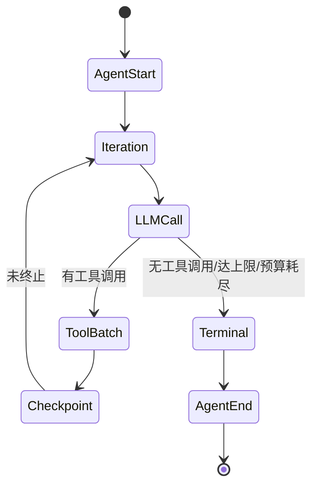

# 领域:agent-core(智能体核心)

| 元数据 | 值 |
|--------|----|
| 业务组 | agent |
| 一句话 | Agent 统一抽象与四种形态、供应商中立数据契约、提示词模板 |
| 负责人 | vogo 维护者 |
| 状态 | active |
| 依赖领域 | model、tooling、memory、guard、orchestration(仅 TaskAgent/WorkflowAgent 依赖) |
| 对外 API | 是(Go 库 API) |
| 覆盖包 | `agent`、`schema`、`prompt` |

## 概述

本领域回答两个根本问题:**"什么是一个 Agent"** 与 **"Agent 之间说什么语言"**。

- `schema` 是供应商中立的**数据契约层**:定义 Agent 的输入/输出/消息/事件/工具描述/流式通道,屏蔽底层大模型 SDK 差异。它是全框架最底层、零内部依赖的包。
- `agent` 定义 Agent 统一接口与四种编排形态。
- `prompt` 提供系统提示词的模板化与版本化抽象。

**边界(不做):** 不实现大模型调用本身(委托 `model` 领域);不实现工具执行、记忆、护栏、检查点的具体逻辑(只持有它们的接口)。`schema` 不含任何行为策略,只是纯数据;`prompt` 只负责渲染出字符串,不做提示词治理或评测。

## 核心实体(概念层)

- **Agent**:满足 `Run(请求)→响应` 契约、带身份三元组(ID / 名称 / 描述)的执行单元。`StreamAgent` 是其增量流式扩展。
- **四种 Agent 形态**:
  - **任务型(TaskAgent)** —— 唯一"会思考会用工具"的叶子执行单元,实现 ReAct 循环。是本组乃至全框架的**集成中枢**。
  - **路由型(RouterAgent)** —— 分发器:从若干带描述的候选 Agent 中选一个并原样转发请求,自身不调用工具。
  - **工作流型(WorkflowAgent)** —— 编排器:以顺序 / DAG / 循环三种模式组合多个子 Agent,执行委托给 `orchestration` 领域。
  - **自定义型(CustomAgent)** —— 逃生舱:把用户提供的函数直接包装成 Agent。
- **RunRequest / RunResponse**:一次调用的输入/输出信封。
- **Message**:叠加了 Agent 语义元数据的对话消息。
- **ToolDef / ToolResult**:工具的可注册描述 / 中立的执行结果。
- **Event / RunStream**:全谱系可观测事件 / 拉取式流通道。
- **PromptTemplate**:可渲染、具名、带版本的系统提示词。

> 实体的字段、类型与转换关系属于结构细节,以代码为准,不在此重述。

## 业务规则与不变式

| ID | 规则 |
|----|------|
| AC-1 | **ReAct 循环恰好三种终止**:得到最终答案(complete)、达到最大迭代(默认 10)、token 预算耗尽。每种对应一个 StopReason。 |
| AC-2 | **预算双点检查**:每轮 LLM 调用前、每次工具批执行前各检查一次;预算 ≤0 表示无限。 |
| AC-3 | **消息单调累积**:循环中消息只追加,顺序稳定;工具批结果按调用顺序返回,与并发无关。 |
| AC-4 | **护栏三态**:输入/输出/工具结果护栏统一为 Pass / Rewrite / Block;输出护栏对非完成态的"部分结果"只告警不失败。 |
| AC-5 | **检查点尽力而为**:检查点保存失败只记 warn,绝不打断 ReAct 热路径。 |
| AC-6 | **路由不变式**:路由函数必须返回非 nil 的子 Agent,子响应必须非 nil;响应的会话 ID 始终被重写为请求的会话 ID。 |
| AC-7 | **供应商中立**:`schema` 不得引入任何厂商私有概念(章程红线)。 |

## 状态与转换

任务型 Agent 一次运行的生命周期(事件序):

断点续跑(Resume):从迭代存储载入最新检查点,复用完全相同的循环骨架与终止路径;跳过输入护栏(原运行已校验),但输出与工具结果护栏仍生效。检查点已是终态则拒绝续跑。

## 领域事件

任务型 Agent 在整条 ReAct 路径上发出结构化事件:AgentStart/End、IterationStart、TextDelta(流式)、ToolCall/ToolResult、LLM 调用、Token 预算、护栏、技能、编排、上下文构建。消费者为 `platform` 组的 hook 与流式调用方。

## 与其他领域的交互

- **model**:通过 `ChatCompleter` 链发起 LLM 调用,并接入上下文编辑中间件。
- **tooling**:通过工具注册表注册与执行工具;技能向其注入提示与过滤工具。
- **memory**:多轮会话记忆的读写与 session 提升;上下文装配管线来自 `context`。
- **guard**:输入/输出/工具结果三处护栏。
- **orchestration**:工作流型 Agent 的 DAG/循环执行,任务型的断点续跑存储。

技术实现(选项、ReAct 具体流程、路由内置函数)见 [agent-core-design](agent-core-design.md)。
