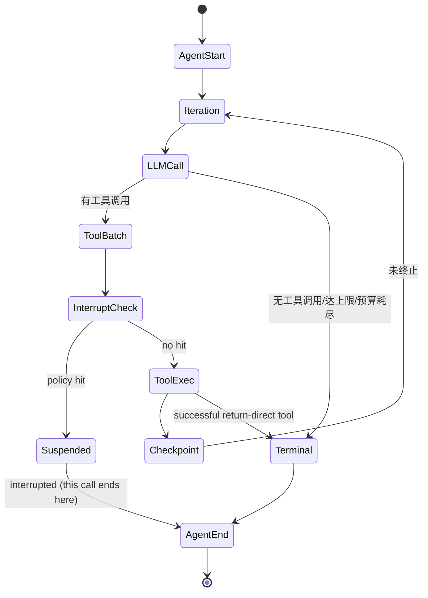

# 领域:agent-core(智能体核心)

| 元数据 | 值 |
|--------|----|
| 业务组 | agent |
| 一句话 | Agent 统一抽象与四种形态、provider-neutral 数据契约、提示词模板 |
| 负责人 | vogo 维护者 |
| 状态 | active |
| 依赖领域 | model、tooling、memory、guard、orchestration(仅 TaskAgent/WorkflowAgent 依赖) |
| 对外 API | 是(Go 库 API) |
| 覆盖包 | `agent`、`schema`、`prompt` |

## 概述

本领域回答两个根本问题:**"什么是一个 Agent"** 与 **"Agent 之间说什么语言"**。

- `schema` 是**数据契约层**:定义 Agent 的输入/输出/消息/事件/工具描述/流式通道。`Message` 以 provider-neutral 的 canonical 状态(`role` + `parts`)为唯一事实源,可选 `origin` 缓存未修改的厂商原生 wire 供同协议回放;读取统一走访问器(Role/Text/ToolCalls/…),因此上层业务代码无需按厂商分叉。它是全框架最底层、仅依赖标准库的包。
- `agent` 定义 Agent 统一接口与四种编排形态。
- `prompt` 提供系统提示词的模板化与版本化抽象。

**边界(不做):** 不实现大模型调用本身(委托 `model` 领域);不实现工具执行、记忆、护栏、检查点的具体逻辑(只持有它们的接口)。`schema` 不含任何行为策略,只是纯数据;`prompt` 只负责渲染出字符串,不做提示词治理或评测。

## 核心实体(概念层)

- **Agent**:满足 `Run(请求)→响应` 契约、带身份三元组(ID / 名称 / 描述)的执行单元。`StreamAgent` 是其增量流式扩展。
- **四种 Agent 形态**:
  - **任务型(TaskAgent)** —— 唯一"会思考会用工具"的叶子执行单元,实现 ReAct 循环。是本组乃至全框架的**集成中枢**。
  - **路由型(RouterAgent)** —— 分发器:从若干带描述的候选 Agent 中选一个并原样转发请求,自身不调用工具。
  - **工作流型(WorkflowAgent)** —— 编排器:以顺序 / DAG / 循环三种模式组合多个子 Agent,执行委托给 `orchestration` 领域。
  - **自定义型(CustomAgent)** —— 逃生舱:把用户提供的函数直接包装成 Agent。
- **RunRequest / RunResponse**:一次调用的输入/输出信封。
- **Message**:叠加了 Agent 语义元数据的对话消息。用户消息可用 `NewUserMessageWithParts` 混排文本、图片(`MessagePartImage`)与文件(`MessagePartFile`)part;两者是 provider-neutral 的 canonical 内容,具体 wire 形态由 `model` 领域的 codec 决定(见 [model.md](../../capability/model/model.md))。
- **ToolDef / ToolResult**:工具的可注册描述 / 中立的执行结果。`ToolResult.Text()` 是取其文本的推荐入口 —— 它只返回第一个文本 part(框架实际发给模型的那段),与拼接全部文本的 `Message.Text()` 刻意不同;需要完整或多模态内容时直接读 `Content`。
- **Run 值(Run values)**:一次运行内、进程内的临时键值表,供多个工具在同一次执行中传递中间状态。它不是会话记忆:生命周期是「这一次运行」,而非「这个会话」。
- **Event / RunStream**:全谱系可观测事件 / 拉取式流通道。
- **自定义事件(custom event)**:由调用方(通常是工具处理器)在执行途中发出的应用级事件。它挂在固定的 `custom` 事件类型下,靠一个应用自选的名称区分含义;框架不解释它,只负责投递。
- **Agent 运行中间件(Agent Middleware)**:装饰整次 Run 的装饰器,以 `Wrap(next RunFunc) RunFunc` 包裹一次 ReAct 执行与终态响应,可短路、可后置改写。它是唯一覆盖「一次运行」控制流的接缝。
- **PromptTemplate**:可渲染、具名、带版本的系统提示词。
- **Interrupt**: a third durable execution state persisted by `interrupt.Store`. When a policy flags a tool batch as needing an external decision, the framework freezes the whole batch before any handler runs and ends this call with `StopReasonInterrupted`. Another process resumes by `interrupt_id`. See glossary [Interrupt](../../../glossary.md) and the three-way boundary in [orchestration](../orchestration/orchestration.md). The enable pair is assembled as one unit via `taskagent.InterruptConfig` + `WithInterrupt` (AC-17).
- **InterruptPolicy**: `taskagent.InterruptPolicy` chooses which call IDs in a tool batch need an injected external decision. `Pending` must be a non-empty unique subset of that batch; `WithInterruptToolNames` is the name-matching convenience implementation. Together with the persistence store it is carried by `taskagent.InterruptConfig`, where `ToolNames` is a field-level alternative to `Policy` — never both.

> 实体的字段、类型与转换关系属于结构细节,以代码为准,不在此重述。

## 业务规则与不变式

| ID | 规则 |
|----|------|
| AC-1 | **ReAct 循环恰好三种终止**:得到最终答案(complete)、达到最大迭代(默认 10)、token 预算耗尽。每种对应一个 StopReason;`complete` 有两条到达路径——模型直接给出最终答案,或成功直返工具给出最终答案(见 AC-13)——不新增停止原因。 |
| AC-2 | **预算双点检查**:每轮 LLM 调用前、每次工具批执行前各检查一次;预算 ≤0 表示无限。 |
| AC-3 | **消息单调累积**:循环中消息只追加,顺序稳定;工具批结果按调用顺序返回,与并发无关。 |
| AC-4 | **护栏三态**:输入/输出/工具结果护栏统一为 Pass / Rewrite / Block;输出护栏对非完成态的"部分结果"只告警不失败。 |
| AC-5 | **检查点尽力而为**:检查点保存失败只记 warn,绝不打断 ReAct 热路径。 |
| AC-6 | **路由不变式**:路由函数必须返回非 nil 的子 Agent,子响应必须非 nil;响应的会话 ID 始终被重写为请求的会话 ID。 |
| AC-7 | **协议保真**:`schema` 消息保存产出它的厂商 wire 原文,不做有损归一;跨协议回放须显式失败(`ErrProtocolMismatch`),不得隐式转换(章程红线)。 |
| AC-8 | **Run 值以「一次运行」为作用域**:一次运行内的所有工具(含跨轮次、含并行批)共享同一张临时值表;不同运行之间互不可见,即便同一 Agent、同一会话 ID。该表不持久化、不进检查点,续跑从空表开始。 |
| AC-9 | **自定义事件是尽力而为的可观测性**:发不出去(无流、流已关闭/取消、发射器拒绝)就丢弃,既不报错也不改变工具结果;因此它不得成为驱动核心业务状态转换的唯一依据。事件载荷的密封性不因此放松 —— 调用方能选的只有名称与载荷,不能新增顶层事件类型。 |
| AC-10 | **一条链、一次运行、恰好一次**:Agent Middleware 链在 `Run` 与 `RunStream` 上是同一条,每个中间件对每个顶层调用恰好执行一次;ReAct 迭代、模型重试与工具数量都不放大调用次数。多个中间件前置按注册序、后置逆序;nil 条目跳过。 |
| AC-11 | **短路与改写都不绕过护栏**:不调用 `next` 即短路(保证无 LLM 调用、无工具执行、无 ReAct 检查点写入);调用 `next` 后原地修改或替换 `RunResponse`。两者产出的消息都仍须经过输出护栏、写入会话记忆,并成为 `AgentEnd.Message` 的唯一来源。 |
| AC-12 | **框架所有的不变式**:`SessionID` 与 `Duration` 最终以请求会话与实测耗时为准,中间件不可伪造;中间件可决定消息、元数据、usage 与 stop reason。`nil, nil` 按 `ErrNilMiddlewareResponse` 失败,中间件错误按运行错误终止终态处理,不产生成功终态事件。 |
| AC-13 | **直返工具(ReturnDirect)**:被 `taskagent.WithReturnDirectTools` 标记的工具成功后,ReAct 循环跳过下一轮模型调用,把护栏后的 `ToolResult.Text()` 包装为最终 assistant 消息并以 `complete` 终止。同批全部工具仍按既有并发规则执行完毕;在模型调用顺序中选第一个「名称已配置且最终结果成功」的工具,完成时序不参与裁决。失败路径(handler/Registry 错误、`IsError` 结果、工具结果护栏 Block)绝不短路,整批结果照常回填。直返只跳过模型轮次,输出护栏、消息记忆、Agent middleware 后置与 `AgentEnd` 照常运行;usage 只累计已发生的模型调用。 |
| AC-14 | **Interrupt suspend point**: when `WithInterruptPolicy` (+ `WithInterruptStore`) flags any call in a tool batch, `runReactLoop` freezes the whole batch before `executeToolBatch` — no handler runs, no `tool_call_start/end`. `StopReasonInterrupted` is returned only after `interrupt.Store.Create` succeeds; a store failure is a hard Run error, never a fake suspend. `Pending` is a non-empty unique subset of the batch (duplicates and unknown IDs are rejected before persist). `ResumeInterrupt(ctx, req)` injects decisions by `interrupt_id + tool_call_id`; sibling calls in the original `ToolCalls` order run only once every pending call has a decision, inheriting the same logical Run's consumed token budget. Omitting decisions probes a Pending record and retries resume on a Ready record. Submit never demotes `Resuming` back to `Ready`. Each durably committed decision emits `interrupt_decision_stored`, including a valid prefix that landed before a later item in the same call was rejected — and only those: an idempotent resubmission of an already stored decision writes nothing and emits nothing. Which decisions those are is taken from what `SubmitDecisions` reports it committed, not from a before/after comparison of the record, so concurrent resumers submitting the same decision still emit exactly one event. Does not enter the Agent middleware chain, does not re-run input guards, starts with empty Run values. Interrupt is an on/off unit: store and policy source must be set together or neither, and the policy source is exactly one of a custom `Policy` or `ToolNames` — never both. A broken combination is returned as `ErrInterruptConfig` at construction time by `NewValidated` / `QuickValidated`; the legacy `New` / `Quick` keep failing at the first Run/RunStream/Resume/ResumeInterrupt preflight as defense in depth (AC-17). |
| AC-15 | **多模态输入仅对用户消息有效**:`MessagePartImage`/`MessagePartFile` 只能出现在 `RoleUser` 消息,且每个 part 恰好一个来源(URL、Data,文件另可 FileID);缺失/多个来源、内联 Data 缺 MimeType、图片 MimeType 非 `image/*`、错误角色、跨类型字段均在 `Message.Validate()` 阶段失败,不静默丢弃媒体或改写来源。辅助字段同样绑定来源:MimeType 与 Filename 只有内联 Data 来源有 wire 字段承载,挂在 URL / FileID 来源上无处可去,因此一并在 `Validate()` 失败,而不是编码时悄悄丢掉。反向亦然:媒体字段(URL / Data / MimeType / FileID / Filename)只能出现在 image/file part 上 —— 文本、thinking、tool_call、tool_result part 携带任一媒体字段同样在 `Validate()` 失败,因为 codec 只从 image/file part 读取来源,放行等于静默丢弃。某个来源能否进入具体 provider wire 由对应 codec 校验(见 [model.md](../../capability/model/model.md)):不可表示的组合(OpenAI 文件 URL、Anthropic FileID)在 backend 调用前明确报错;Anthropic document block 丢弃 Filename 是唯一允许的已知降级。 |
| AC-16 | **Interrupt 只在顶层可恢复**:一次挂起只有直接调用 TaskAgent `Run`、拿到 `RunResponse.Interrupt` 的宿主能组织人工决策并 `ResumeInterrupt`。框架内置的父层消费路径 —— agent-as-tool、RouterAgent、WorkflowAgent 顺序步骤、orchestrate 的 DAG 节点 / 循环体 / 条件节点 / DynamicSpawn 父子 Runner / 前向恢复 —— 都不提供 resume 通路,因此在读取或改写子响应的任何输出**之前**判定 `StopReason == interrupted` **或** `Interrupt != nil`(`RunResponse.IsInterrupted()`),任一命中即拒绝:agent-as-tool 返回 `IsError=true` 的工具结果,其余返回 Go error。拒绝的错误说明「nested HITL 不受支持」,不复制半截 assistant 文本、不转发 `InterruptDescriptor`;父层不询问人类、不调用 `ResumeInterrupt`、不改选路由或跳过步骤。两个信号任一成立即足以证明该响应不可消费,自定义 Agent 或 middleware 产生不一致组合时不得靠缺少另一字段绕过。拒绝发生在子 Agent 已创建 interrupt **之后**,因此它不阻止 Pending 记录产生、也不清理该记录;要恢复就必须由顶层直接运行该 Agent。`max_iterations_exceeded`、`token_budget_exhausted` 等其他停止原因不在此列,照旧按正常响应消费。 |
| AC-17 | **构造期校验与分组配置**:Interrupt 的四项设置收成 `taskagent.InterruptConfig` + `WithInterrupt`(Store / Policy / ToolNames / LeaseTTL),护栏三条执行位置链收成 `GuardsConfig` + `WithGuards`(Input / Output / ToolResult)。分组选项在其出现位置**整组赋值**(替换该组全部字段,不合并);新旧 Option 混用沿用「后应用者生效」,校验以全部 Option 应用后的**最终状态**为准,因此后续单项可修正或破坏先前组合。`NewValidated` / `QuickValidated` 是返回 error 的校验构造入口:非法 Interrupt 组合 —— 仅设 Store、仅设 Policy/ToolNames、或 Policy 与 ToolNames 同设 —— 在构造期即返回可 `errors.Is(err, ErrInterruptConfig)` 判定的错误,不产生任何模型、存储或工具 I/O;旧 `New` / `Quick` 签名不变、不新增构造期错误,同一 `checkInterruptConfig` 仍在 Run/RunStream/Resume/ResumeInterrupt 的 preflight 作为纵深防御。所有有效配置的默认值(含默认租约)、Option 覆盖顺序、Guard 链顺序与 Interrupt/Resume 运行时语义,在分组写法与等价单项写法下完全一致。 |

## Agent 运行中间件链

完整 ReAct 拦截点选型与执行顺序见 [agent-core-design.md § ReAct interception point decision guide](agent-core-design.md#react-interception-point-decision-guide)。

一次 Run 只有**一个装饰器接缝**。四个相邻扩展点按层级分工,各自只做自己的事:

| 层 | 机制 | 做什么 | 不做什么 |
|----|------|--------|----------|
| Agent Run 层 | `agent.Middleware`(+`MiddlewareFunc`/`ChainMiddleware`,装配入口 `taskagent.WithMiddleware`) | 装饰整次 ReAct 执行;可短路、可改写/替换终态响应;同步与流式共用同一条链 | 不做单次模型调用治理,不做逐事件变换 |
| Agent 事件层 | `hook.Hook` / `hook.AsyncHook`、`agent.StreamMiddleware` | Hook 只读观察生命周期事件;StreamMiddleware 拦截/变换/丢弃发往流消费者的事件 | 不改变运行结果,不能短路 |
| 模型调用层 | `largemodel.Middleware` | 包裹每轮 `Caller.Call`/`CallStream`:缓存、限流、超时、日志、指标 | retry / failover 只属于 `largemodel/router` 端点池 |
| 工具执行层 | `tool.ExecuteMiddleware`(+`WithExecuteMiddleware`,见 [tooling](../../capability/tooling/tooling.md)) | 工具调用前后的拦截、短路与结果/错误改写;覆盖本地/外部/分派错误 | 不装饰整次 Agent Run,不变换流事件,不包裹模型调用 |

执行语义:

- 同步 `Run` 与流式 `RunStream` 各执行同一条链**恰好一次**;同 Agent 的并发运行共享中间件实例,实现须自保并发安全。
- 上下文构建(系统提示、会话记忆、技能注入、工具解析)在链之前完成,以保持 `RunStream` 构建错误同步浮现的既有语义。因此中间件改写 `req.Messages` 不会回溯影响模型实际看到的输入 —— 要改输入用输入护栏或 `vctx` 源。
- 流式路径不缓冲、不重放已发送的 `TextDelta`。终态改写只体现在最终 `AgentEnd` 与框架持久化结果;若需逐事件改写,用 `StreamMiddleware`。这是保留实时首包能力的明确取舍。
- `Resume` 不进入链:它续跑的是一次已经过链的运行,重复进入会令短路中间件丢弃检查点已付出的工作。

选型与迁移:

- **观察事件、不改结果** → Hook。既有 Hook 无需迁移。
- **只处理流式事件**(增量文本改写、事件丢弃)→ `StreamMiddleware`。既有用法无需迁移。
- **单次模型调用治理**(缓存、限流、超时、日志、指标)→ `largemodel.Middleware`;重试与故障转移留在端点池,不得在 Agent 中间件重复实现。
- **整次运行的审计、短路、合成应答、终态改写,且要同步/流式同链** → `agent.Middleware`。需要把 Hook 中「改变运行结果」的逻辑迁到这里;事件采集可留在 Hook。
- **工具调用前后拦截** → `tool.WithExecuteMiddleware`(见 [tooling](../../capability/tooling/tooling.md))。

## 状态与转换

任务型 Agent 一次运行的生命周期(事件序):

```mermaid
stateDiagram-v2
    [*] --> AgentStart
    AgentStart --> Iteration
    Iteration --> LLMCall
    LLMCall --> ToolBatch: 有工具调用
    ToolBatch --> InterruptCheck
    InterruptCheck --> Suspended: policy hit
    InterruptCheck --> ToolExec: no hit
    ToolExec --> Checkpoint
    Checkpoint --> Iteration: 未终止
    ToolExec --> Terminal: successful return-direct tool
    LLMCall --> Terminal: 无工具调用/达上限/预算耗尽
    Terminal --> AgentEnd
    Suspended --> AgentEnd: interrupted (this call ends here)
    AgentEnd --> [*]
```

断点续跑(Resume):从迭代存储载入最新检查点,复用完全相同的循环骨架与终止路径;跳过输入护栏(原运行已校验),但输出与工具结果护栏仍生效。检查点已是终态则拒绝续跑。

Cross-process interrupt resume (`ResumeInterrupt`): see AC-14. `Suspended` does not write an iteration checkpoint — `interrupt.Store` is an independent durable state machine, not a variant of `IterationStore`. The boundary is in [orchestration](../orchestration/orchestration.md).

`Suspended` 只对**直接调用者**有意义(AC-16):把配置了 interrupt 的 TaskAgent 放进 agent-as-tool、RouterAgent 路由、WorkflowAgent 步骤或 DAG 节点,得到的是明确的「不支持 nested HITL」错误,而不是一条可恢复的挂起。装配期不做能力校验 —— 通用 `Agent` 契约不暴露子 Agent 是否配置了 InterruptPolicy/Store,判定只能落在响应边界。

## 领域事件

任务型 Agent 在整条 ReAct 路径上发出结构化事件:AgentStart/End、IterationStart、TextDelta(流式)、ToolCall/ToolResult、LLM 调用、Token 预算、护栏、技能、编排、上下文构建、interrupt (`interrupt_created` / `interrupt_decision_stored` / `interrupt_resumed`; identity, status, tool-call IDs and timing only — no decision or message body). 消费者为 `platform` 组的 hook 与流式调用方。

除这些**内置事件**外,还有一类**自定义事件**:内置事件描述框架生命周期、语义由框架定义;自定义事件只表达调用方自己定义的运行期信息(典型场景是一次长耗时工具调用内部的分阶段进度),框架既不定义也不校验其含义。二者的关键差别对消费者是可见的 —— 内置事件看顶层类型即可分派,自定义事件必须**先看 `custom` 类型、再看载荷里的名称**才能解释,因为所有自定义事件共用同一个顶层类型。名称由应用自行命名与演进,框架不维护名称注册表,也不会把名称提升成新的事件类型。

自定义事件的用途边界:它服务于运行中的即时可观测性,不承担业务状态存储、跨进程投递与可靠消息职责(AC-9)。要留存的状态归 memory / workspace。

## 与其他领域的交互

- **model**:通过 `largemodel.Caller` 链发起 LLM 调用,并接入上下文编辑中间件。
- **tooling**:通过工具注册表注册与执行工具;技能向其注入提示与过滤工具。
- **memory**:多轮会话记忆的读写与 session 提升;上下文装配管线来自 `context`。跨运行、跨进程要留存的状态归 memory / workspace,Run 值只负责单次运行内的临时传递。
- **guard**:输入/输出/工具结果三处护栏。
- **orchestration**:工作流型 Agent 的 DAG/循环执行,任务型的断点续跑存储(`checkpoint`)与 cross-process interrupt/resume store (`interrupt`).

技术实现(选项、ReAct 具体流程、路由内置函数)见 [agent-core-design](agent-core-design.md)。
