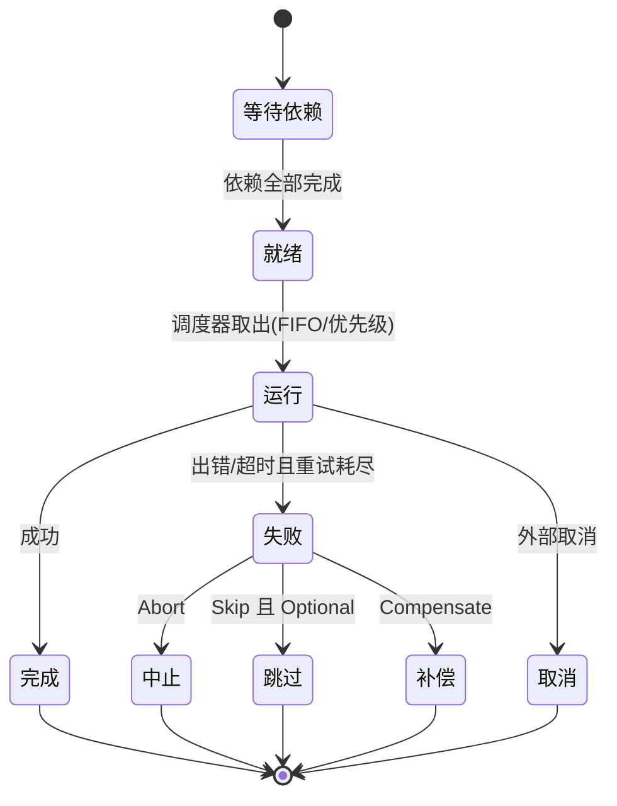

# 设计:orchestration

对应领域行为见 [orchestration.md](orchestration.md)。

## 组件与职责

| 文件/关键类型 | 设计角色 |
|---------------|----------|
| `orchestrate/dag.go`(DAG 执行器) | 就绪集调度、并发控制、错误策略分派、收尾 |
| `orchestrate/orchestrate.go`(`Node`/`DAGConfig`/`ErrorStrategy`/`DAGOption`) | 图模型与函数式配置项 |
| `orchestrate/priority.go` | 优先级队列调度,可自动按关键路径计算优先级 |
| `orchestrate/backpressure.go` | 自适应并发度 |
| `orchestrate/resource.go` | 按资源标签的并发上限与速率限制 |
| `orchestrate/compensate.go`(`Compensatable`/`IdempotentChecker`) | 补偿(Saga)与幂等守护 |
| `orchestrate/conditional.go`/`loop.go`/`spawn.go` | 条件、循环、动态派生节点 |
| `orchestrate/aggregator.go` | 结果聚合 |
| `orchestrate/checkpoint.go`(`CheckpointStore`/`InMemoryCheckpointStore`) | DAG 级存/取与回放 |
| `checkpoint` 包(`IterationStore`) | ReAct 迭代级快照,文件系统后端 |

## 关键设计决策

- **函数式配置(DAGOption)**:并发度、错误策略、优先级调度、背压、资源限额、补偿、事件处理器全部经 `With*` 选项组合,默认 FIFO 调度、无背压、无补偿。
- **调度模型**:默认按就绪先入先出;开启优先级调度后用优先级队列,可自动按关键路径赋优先级以缩短总时长。
- **资源治理**:节点用资源标签声明其占用,执行器按标签施加并发上限与速率限制,实现跨节点的资源公平与保护。
- **收尾单点(锁契约)**:错误与取消路径收敛到同一收尾逻辑,确保加锁成对释放、事件一致通知 —— 这是近期"锁契约硬化 / 收敛错误与取消收尾路径"的核心改动,防止提前返回导致的持锁或重复解锁。
- **双轨检查点**:迭代级(`checkpoint`)服务单个长时 Agent 的续跑;DAG 级(`orchestrate`)服务整图回放。两者刻意分离,仅目录布局巧合相似,不共享读路径。

## 状态机

## 非功能考量

- **并发安全**:DAG 事件处理器所有方法必须并发安全;共享状态的锁必须成对收尾(见领域规则 OR-4/OR-5)。
- **可恢复性**:回放模式从检查点重建而不执行,用于崩溃恢复与调试。
- **背压**:在高负载下自适应收缩并发,避免下游(模型/工具)过载。

## 架构决策提示

"迭代级与 DAG 级检查点双轨分离""补偿幂等契约""锁收尾单点"均为架构级决策,建议后续补记为 ADR(见 `architecture/adr/`)。
