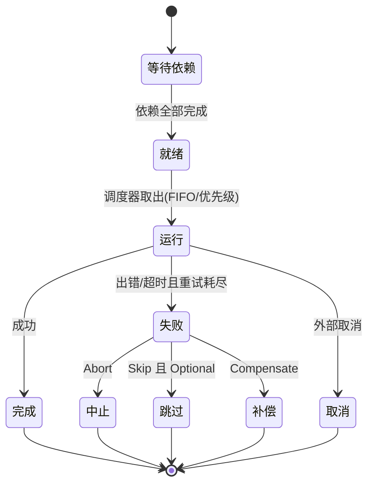
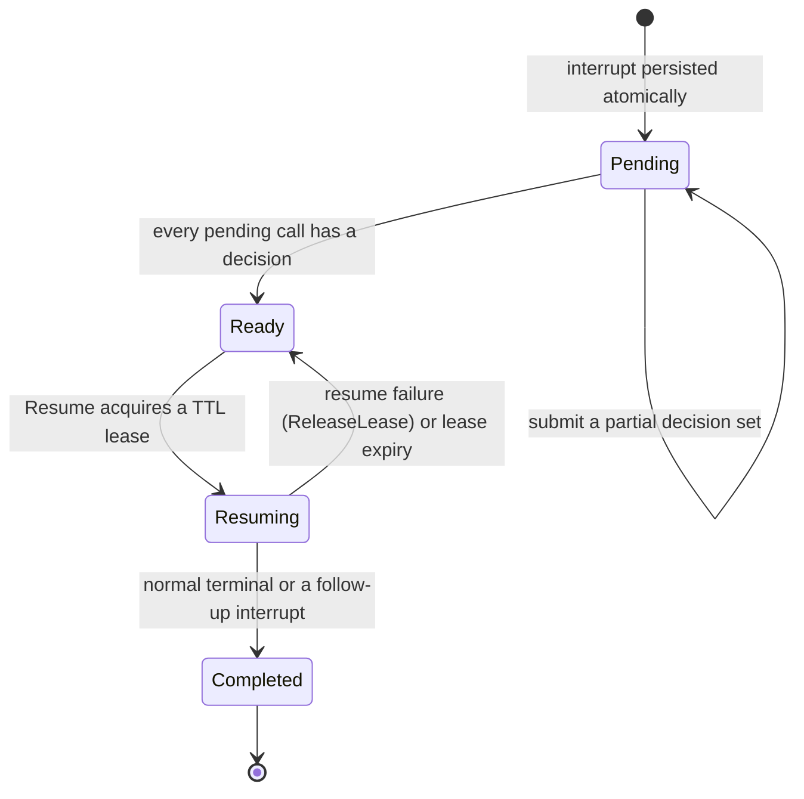

# 设计:orchestration

对应领域行为见 [orchestration.md](orchestration.md)。

## 组件与职责

| 文件/关键类型 | 设计角色 |
|---------------|----------|
| `orchestrate/dag.go`(DAG 执行器) | 就绪集调度、并发控制、错误策略分派、收尾 |
| `orchestrate/orchestrate.go`(`Node`/`DAGConfig`/`ErrorStrategy`/`DAGOption`) | 图模型与函数式配置项 |
| `orchestrate/priority.go` | 优先级队列调度,可自动按关键路径计算优先级 |
| `orchestrate/backpressure.go` | 自适应并发度 |
| `orchestrate/resource.go` | 按资源标签的并发上限与速率限制 |
| `orchestrate/compensate.go`(`Compensatable`/`IdempotentChecker`) | 补偿(Saga)与幂等守护 |
| `orchestrate/conditional.go`/`loop.go`/`spawn.go` | 条件、循环、动态派生节点 |
| `orchestrate/aggregator.go` | 结果聚合 |
| `orchestrate/checkpoint.go`(`CheckpointStore`/`InMemoryCheckpointStore`) | DAG 级存/取与回放 |
| `checkpoint` 包(`IterationStore`) | ReAct 迭代级快照,文件系统后端 |
| `interrupt` package (`Store`/`Record`/`MapStore`/`FileStore`) | Pre-tool-batch suspend state machine. `FileStore` uses an `<id>.lock` file for cross-process exclusion on every mutation of that record (`AcquireLease`, `SubmitDecisions`, `Delete`, …). |

## 关键设计决策

- **函数式配置(DAGOption)**:并发度、错误策略、优先级调度、背压、资源限额、补偿、事件处理器全部经 `With*` 选项组合,默认 FIFO 调度、无背压、无补偿。
- **调度模型**:默认按就绪先入先出;开启优先级调度后用优先级队列,可自动按关键路径赋优先级以缩短总时长。
- **资源治理**:节点用资源标签声明其占用,执行器按标签施加并发上限与速率限制,实现跨节点的资源公平与保护。
- **收尾单点(锁契约)**:错误与取消路径收敛到同一收尾逻辑,确保加锁成对释放、事件一致通知 —— 这是近期"锁契约硬化 / 收敛错误与取消收尾路径"的核心改动,防止提前返回导致的持锁或重复解锁。
- **双轨检查点**:迭代级(`checkpoint`)服务单个长时 Agent 的续跑;DAG 级(`orchestrate`)服务整图回放。两者刻意分离,仅目录布局巧合相似,不共享读路径。
- **Interrupt is an independent state machine, not a checkpoint flag**: `interrupt.Store` and `checkpoint.IterationStore` are two persistence interfaces whose invariants conflict — checkpoint assumes "this is a complete finished-turn snapshot"; interrupt assumes "this is a pre-execution hang with an unfinished pending set and a lease". Stuffing the latter into the former would break checkpoint completeness and would make `Resume(sessionID)` unable to tell which the caller wanted. A new interface costs a second contract and state machine; it buys independent retention, backends, and resume semantics. See [ADR 0001](../../../architecture/adr/0001-interrupt-independent-state-machine.md).
- **Lease over a permanent lock**: `interrupt.Store.AcquireLease` is owner + expiry, so a crashed resumer can be taken over; the cost is no end-to-end exactly-once (ordinary tools may replay after takeover; side-effecting tools still need caller-supplied idempotency keys or compensation). `FileStore` uses `O_CREATE|O_EXCL` on `<id>.lock` as the critical-section gate, held only for one read-modify-write (or Delete). Lease identity and expiry live on the Record, not in the lock file's existence. `SubmitDecisions` never demotes `Resuming` to `Ready`.

## 状态机

```mermaid
stateDiagram-v2
    [*] --> 等待依赖
    等待依赖 --> 就绪: 依赖全部完成
    就绪 --> 运行: 调度器取出(FIFO/优先级)
    运行 --> 完成: 成功
    运行 --> 失败: 出错/超时且重试耗尽
    运行 --> 取消: 外部取消
    失败 --> 中止: Abort
    失败 --> 跳过: Skip 且 Optional
    失败 --> 补偿: Compensate
    完成 --> [*]
    中止 --> [*]
    跳过 --> [*]
    补偿 --> [*]
    取消 --> [*]
```

## 非功能考量

- **并发安全**:DAG 事件处理器所有方法必须并发安全;共享状态的锁必须成对收尾(见领域规则 OR-4/OR-5)。
- **可恢复性**:回放模式从检查点重建而不执行,用于崩溃恢复与调试。
- **背压**:在高负载下自适应收缩并发,避免下游(模型/工具)过载。

## Interrupt state machine

```mermaid
stateDiagram-v2
    [*] --> Pending: interrupt persisted atomically
    Pending --> Pending: submit a partial decision set
    Pending --> Ready: every pending call has a decision
    Ready --> Resuming: Resume acquires a TTL lease
    Resuming --> Completed: normal terminal or a follow-up interrupt
    Resuming --> Ready: resume failure (ReleaseLease) or lease expiry
    Completed --> [*]
```

`SubmitDecisions` does not appear as a Resuming → Ready edge: an idempotent resubmit while a lease is live leaves the record in Resuming.

## Architecture decision notes

"Dual-track iteration vs DAG checkpoints", "compensation idempotency", "single lock-teardown path", and "interrupt as an independent state machine rather than extending checkpoint" are architecture-level decisions. Interrupt is recorded as [ADR 0001](../../../architecture/adr/0001-interrupt-independent-state-machine.md).
