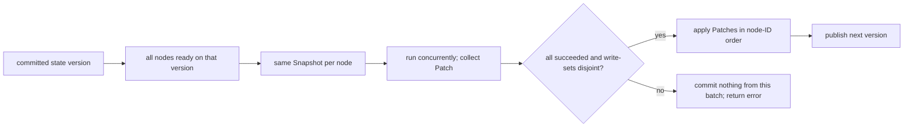
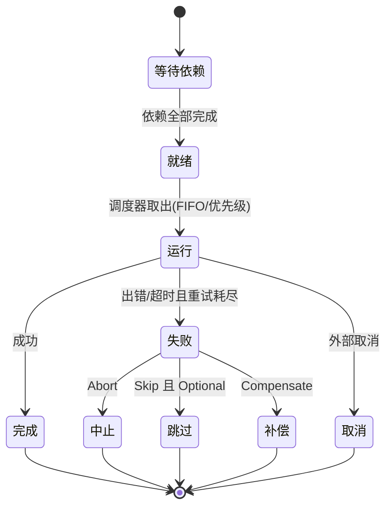
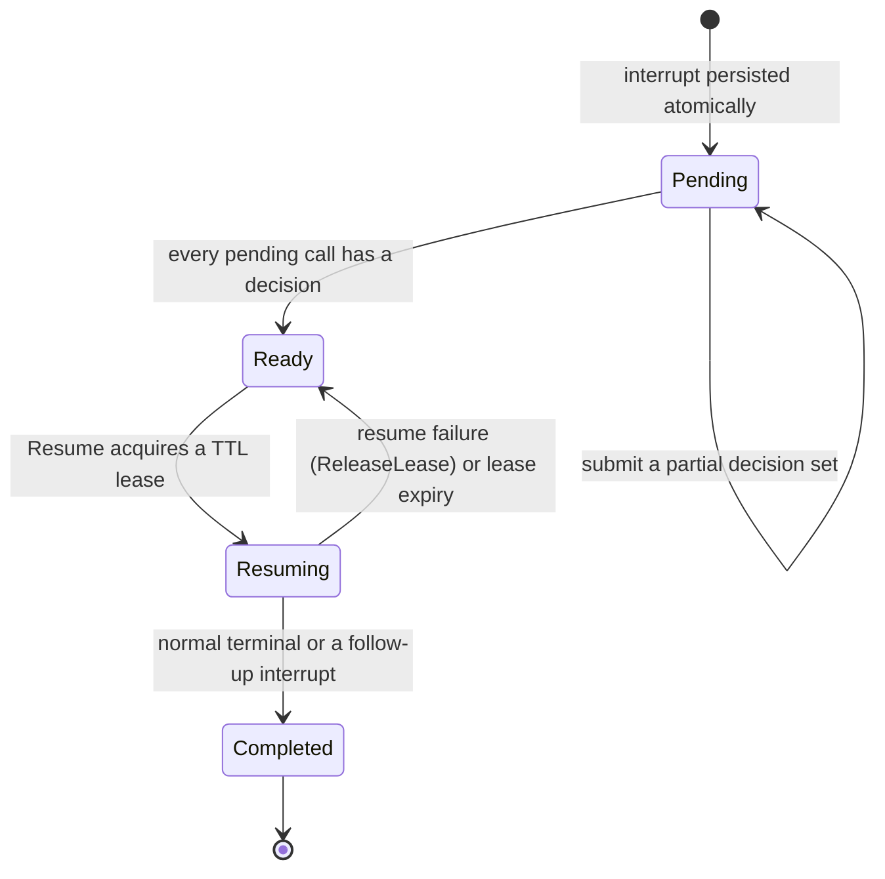

# 设计:orchestration

对应领域行为见 [orchestration.md](orchestration.md)。

## 组件与职责

| 文件/关键类型 | 设计角色 |
|---------------|----------|
| `orchestrate/dag.go`(DAG 执行器) | 就绪集调度、并发控制、错误策略分派、收尾 |
| `orchestrate/orchestrate.go`(`Node`/`DAGConfig`/`ErrorStrategy`/`DAGOption`) | 图模型与函数式配置项 |
| `orchestrate/priority.go` | 优先级队列调度,可自动按关键路径计算优先级 |
| `orchestrate/backpressure.go` | 自适应并发度 |
| `orchestrate/resource.go` | 按资源标签的并发上限与速率限制 |
| `orchestrate/compensate.go`(`Compensatable`/`IdempotentChecker`) | 补偿(Saga)与幂等守护 |
| `orchestrate/conditional.go`/`loop.go`/`spawn.go` | 条件、循环、动态派生节点 |
| `orchestrate/aggregator.go` | 结果聚合 |
| `orchestrate/checkpoint.go`(`CheckpointStore`/`InMemoryCheckpointStore`) | DAG 级存/取与回放 |
| `workflow` 包(`New[S]`/`Node[S]`/`Snapshot`/`Patch`/`Field`/`AdaptRunner`) | 强类型工作流:批次屏障、写集合冲突、显式 Agent mapper |
| `checkpoint` 包(`IterationStore`) | ReAct 迭代级快照,文件系统后端 |
| `interrupt` package (`Store`/`Record`/`MapStore`/`FileStore`) | Pre-tool-batch suspend state machine. `FileStore` takes an OS advisory lock on an `<id>.lock` file for cross-process exclusion on every mutation of that record (`AcquireLease`, `SubmitDecisions`, `Delete`, …). |

## 关键设计决策

- **函数式配置(DAGOption)**:并发度、错误策略、优先级调度、背压、资源限额、补偿、事件处理器全部经 `With*` 选项组合,默认 FIFO 调度、无背压、无补偿。
- **调度模型**:默认按就绪先入先出;开启优先级调度后用优先级队列,可自动按关键路径赋优先级以缩短总时长。
- **资源治理**:节点用资源标签声明其占用,执行器按标签施加并发上限与速率限制,实现跨节点的资源公平与保护。
- **收尾单点(锁契约)**:错误与取消路径收敛到同一收尾逻辑,确保加锁成对释放、事件一致通知 —— 这是近期"锁契约硬化 / 收敛错误与取消收尾路径"的核心改动,防止提前返回导致的持锁或重复解锁。
- **双轨检查点**:迭代级(`checkpoint`)服务单个长时 Agent 的续跑;DAG 级(`orchestrate`)服务整图回放。两者刻意分离,仅目录布局巧合相似,不共享读路径。
- **Interrupt is an independent state machine, not a checkpoint flag**: `interrupt.Store` and `checkpoint.IterationStore` are two persistence interfaces whose invariants conflict — checkpoint assumes "this is a complete finished-turn snapshot"; interrupt assumes "this is a pre-execution hang with an unfinished pending set and a lease". Stuffing the latter into the former would break checkpoint completeness and would make `Resume(sessionID)` unable to tell which the caller wanted. A new interface costs a second contract and state machine; it buys independent retention, backends, and resume semantics. See [ADR 0001](../../../architecture/adr/0001-interrupt-independent-state-machine.md).
- **Lease over a permanent lock**: `interrupt.Store.AcquireLease` is owner + expiry, so a crashed resumer can be taken over; the cost is no end-to-end exactly-once (ordinary tools may replay after takeover; side-effecting tools still need caller-supplied idempotency keys or compensation). `FileStore` gates the critical section with an OS advisory lock (flock / LockFileEx) on `<id>.lock`, held only for one read-modify-write (or Delete). The kernel owns that lock, which is what makes the gate trustworthy: a live holder is never preempted because its lock "looks old" (an age heuristic would admit a second resumer to a still-running critical section), and a dead holder never wedges the record because the lock dies with its file descriptor. Release drops only the holder's own lock; lock files are never unlinked, since replacing the inode would let a waiter and a newcomer lock different files and both enter. Lease identity and expiry live on the Record, not in the lock file's existence. `SubmitDecisions` never demotes `Resuming` to `Ready`. Queueing for that gate is itself cancelable-by-contract: the in-process mutex that keeps one instance from spinning against its own lock file cannot be abandoned mid-wait, so the gate re-checks the context once both locks are held — a caller whose context died while queued must fail, never write.
- **The store reports what it committed**: `SubmitDecisions` returns the tool-call IDs *this call* durably wrote, alongside the updated record. Callers need that to emit `interrupt_decision_stored` once per real write, and they cannot derive it themselves: two resumers submitting the same decision concurrently both read "absent" before and observe "present" after, so a caller-side before/after diff would have both claim the write and emit the event twice. Only the store, inside its critical section, can tell the writer from the replayer.
- **Typed workflow is a separate result contract, not a Metadata patch channel**: Field handles plus an explicit Change set give merge a write-set without reflecting two complete `S` values or accepting field-name strings. Callers declare getter/setter once per logical field and must reuse that handle; they also own the "getters return immutable/copied reference values" rule. A logical batch is a barrier: every ready node on one committed version sees that version, and nothing is applied until the whole batch succeeds with disjoint writes. Downstream that only needed a fast sibling waits for the slow one; in return, visible state and conflict results do not depend on completion order, load, or `WithMaxConcurrency`. `orchestrate` keeps complete-and-propagate semantics. Graph validation may look similar; the two executors must not share run state.
- **No automatic conflict resolution**: parallel accumulation is done by writing distinct Fields and reducing in a later explicit node. Last-writer-wins, reducers, locks, and CRDTs are out of scope.

## Typed workflow batching

```mermaid
flowchart LR
    A[committed state version] --> B[all nodes ready on that version]
    B --> C[same Snapshot per node]
    C --> D[run concurrently; collect Patch]
    D --> E{all succeeded and write-sets disjoint?}
    E -- yes --> F[apply Patches in node-ID order]
    F --> G[publish next version]
    E -- no --> H[commit nothing from this batch; return error]
```

`AdaptRunner` is the only Agent seam: request and response mappers are explicit. Usage, Duration, and StopReason enter `S` only if the output mapper writes them. Interrupted responses follow OR-10 and never reach the output mapper.

## 状态机

```mermaid
stateDiagram-v2
    [*] --> 等待依赖
    等待依赖 --> 就绪: 依赖全部完成
    就绪 --> 运行: 调度器取出(FIFO/优先级)
    运行 --> 完成: 成功
    运行 --> 失败: 出错/超时且重试耗尽
    运行 --> 取消: 外部取消
    失败 --> 中止: Abort
    失败 --> 跳过: Skip 且 Optional
    失败 --> 补偿: Compensate
    完成 --> [*]
    中止 --> [*]
    跳过 --> [*]
    补偿 --> [*]
    取消 --> [*]
```

## 非功能考量

- **并发安全**:DAG 事件处理器所有方法必须并发安全;共享状态的锁必须成对收尾(见领域规则 OR-4/OR-5)。Typed `workflow` waits for every node goroutine in a batch before merge or return, so completion order cannot leak a Patch into a sibling Snapshot; `go test -race` covers the scheduler. Mutating Snapshot through shared maps/slices/pointers is a caller contract violation, not a merge feature.
- **可恢复性**:回放模式从检查点重建而不执行,用于崩溃恢复与调试。Typed workflow state is not persisted.
- **背压**:在高负载下自适应收缩并发,避免下游(模型/工具)过载。`workflow.WithMaxConcurrency` only caps goroutines; it does not change batches or conflicts.

## Interrupt state machine

```mermaid
stateDiagram-v2
    [*] --> Pending: interrupt persisted atomically
    Pending --> Pending: submit a partial decision set
    Pending --> Ready: every pending call has a decision
    Ready --> Resuming: Resume acquires a TTL lease
    Resuming --> Completed: normal terminal or a follow-up interrupt
    Resuming --> Ready: resume failure (ReleaseLease) or lease expiry
    Completed --> [*]
```

`SubmitDecisions` does not appear as a Resuming → Ready edge: an idempotent resubmit while a lease is live leaves the record in Resuming.

## Architecture decision notes

"Dual-track iteration vs DAG checkpoints", "compensation idempotency", "single lock-teardown path", and "interrupt as an independent state machine rather than extending checkpoint" are architecture-level decisions. Interrupt is recorded as [ADR 0001](../../../architecture/adr/0001-interrupt-independent-state-machine.md).
