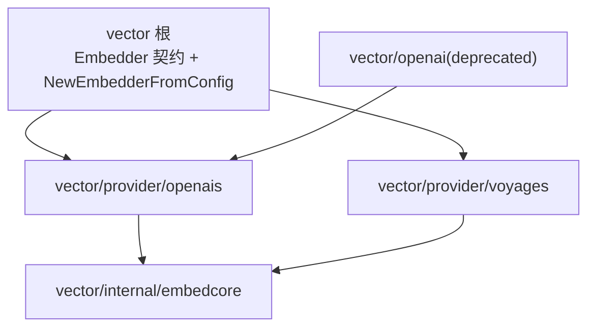

# 设计:service

对应领域行为见 [service.md](service.md)。

## 组件与职责

| 包/关键类型 | 设计角色 |
|-------------|----------|
| `service`(`Service`/`Config`/`handler`) | HTTP 服务与路由 |
| `service`(`Task`/`TaskStore`) | 异步任务与状态存储 |
| `hook`(`Manager`/`Hook`/`AsyncHook`/`HookFunc`) | 事件订阅与分发 |
| `eval`(`Evaluator` 及各实现) | 评测器家族 |
| `eval`(`CompositeEvaluator`/`WeightedEvaluator`) | 评测组合与加权 |
| `eval`(`EvalCase`/`EvalResult`/`EvalReport`/`batch`) | 评测数据模型与批量 |
| `vector`(`VectorStore`/`Embedder`/`MapVectorStore`) | 向量召回最小接口 + 内存实现 |
| `vector`(`Provider`/`EmbedderConfig`/`NewEmbedderFromConfig`) | 按配置构造嵌入器的唯一门面 |
| `vector/qdrant` | qdrant REST 后端(v1.x,thin HTTP 客户端) |
| `vector/provider/openais` | OpenAI 嵌入器(独立 thin HTTP 客户端) |
| `vector/provider/voyages` | Voyage 嵌入器(Anthropic 文档推荐的 Claude 侧嵌入服务) |
| `vector/internal/embedcore` | 根包与 provider 共用的哨兵错误契约点(非公开 API) |
| `vector/openai` | 旧导入路径的 deprecated 兼容层,别名转发至 `openais` |
| `vector/archivehook`/`session/tree/vectorhook` | 把会话内容归档进向量库 |

## 关键设计决策

- **执行三语义一等**:sync/streaming/async 在服务层平级支持,async 经 TaskStore 记录状态、可查询,满足章程"三语义齐全"。
- **hook 主流程解耦**:同步 hook 与异步 hook 分离;异步 hook 不阻塞 Agent 主流程,分发失败不上抛打断运行。
- **评测器可组合**:每个评测器单一标准,Composite/Weighted 把多标准汇总为综合评分,支持批量报告。
- **向量接口刻意最小**:只定义存取与嵌入的最小面,让 qdrant/pgvector/chroma/pinecone 等无扭曲实现;内存 MapVectorStore 覆盖测试与本地实验。
- **后端为 thin HTTP 客户端**:qdrant、openais、voyages 后端刻意是 net/http + JSON 的薄封装,不引重依赖,便于替换。
- **嵌入按厂商分层**:目录形态对齐 `largemodel/provider/`,但不并入 `largemodel` —— 嵌入与聊天是两条独立协议,合并会把聊天的 schema/预算/路由语义强加给嵌入。
- **共同配置只取交集**:`EmbedderConfig` 只承载 `Provider`/`APIKey`/`BaseURL`/`Model`。厂商专属参数(OpenAI `dimensions`,Voyage `input_type`/`truncation`/`output_dimension`)不进统一配置 —— 塞进去要么有损归一,要么留下一半场景被静默忽略的字段。
- **Voyage 用途固定在实例上**:`input_type` 的 query/document 优化无法从 `Embed`/`BatchEmbed` 方法名推断(两者入库与召回都在用)。因此它是实例级选项:检索优化场景建两个同模型同维度的实例,入库注入 document 实例,召回注入 query 实例,接口本身不动。
- **模型默认值不对称是有意的**:空模型时 OpenAI 保留既有默认值以维持兼容,Voyage 则在构造期报错 —— 其 API 要求该字段,且推荐模型逐代变化,框架硬编码会悄悄改变调用方实际嵌入用的模型。

## 嵌入依赖拓扑

依赖严格单向,`vector` 根 → provider → `internal/embedcore`:

- 根包的配置门面要 import 两家 provider,provider 因此**不得**反向 import 根包。两侧都要认的 `ErrEmptyQuery` 只有一个底层实例,放在 `internal/embedcore`,根包按原名导出同一实例 —— `errors.Is(err, vector.ErrEmptyQuery)` 语义不变。
- 连带结果:provider 的接口符合性断言放在根包的外部测试里,而不是各 provider 内部的 `var _ vector.Embedder` 块。
- 两家 provider 互不 import,也都不碰 `largemodel`/`aimodel`。以上四条由 `vector/dependency_test.go` 解析生产文件 import 强制。

## 嵌入器构造方式

两条路都返回同一个 `vector.Embedder`,下游召回代码不区分:

- **按配置构造**(配置文件/环境驱动的接线层):`vector.NewEmbedderFromConfig(vector.EmbedderConfig{...})`,给 `Provider` + `APIKey` + 可选 `BaseURL`/`Model`。provider 缺失或未知在构造期报 `ErrProviderRequired`/`ErrUnknownProvider`,校验错误则原样透出厂商哨兵(如 `voyages.ErrMissingModel`)。全程不发网络请求。
- **按厂商构造**(需要专属能力时):直接 `openais.New(...)` 或 `voyages.New(...)`,用各自的 Option。

凭证只进 Authorization header:不入错误、日志、指标与文档示例。空 `BaseURL` 走厂商官方端点;仅当 `BaseURL` 被改写(本地兼容服务、httptest)时才允许空 key。

**换厂商的数据边界**:provider、模型或输出维度一变,向量就与既有 collection 不兼容。框架不会自动重写既有向量 —— 调用方须换新 collection,或与 store 的 locked dimension 对齐。

## 非功能考量

- **可观测**:hook 是全框架可观测的分发中枢;指标经 hook 输出。
- **可降级**:向量后端或嵌入 API 不可用时(如 key 未配置),召回类功能跳过而非报错。
- **可运维**:HTTP 服务可独立部署为代理运行时;异步任务状态可查询。

## 集成测试布局

`integrations/` 下按领域分套(agent/context/eval/guard/largemodel/mcp/memory/metrics/orchestrate/service/skill/tool/vector),承载跨包端到端矩阵。它们只 mock 模型层,真实运行其余构件,是验证本文所述契约的权威入口。

`vector_tests` 再按嵌入厂商分子矩阵:每个用例对 OpenAI 与 Voyage 各跑一遍,缺 `QDRANT_URL` 跳过整套,缺某家 key 只跳过该家的子用例。每个子用例都显式指定模型、统一输出维度并写入独立 collection,避免两个模型的向量混进同一 collection。
